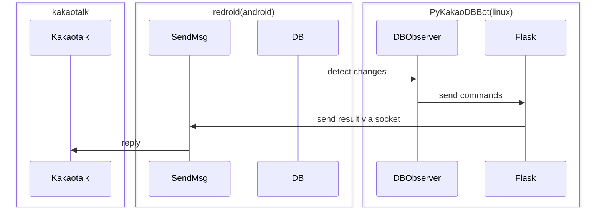

# PyKakaoDBBot
Redroid 및 노티 기반 봇앱을 이용한 파이썬 DB 봇

### 흐름도


## 1. Installation
### 1.1 Clone repository
```shell
git clone https://github.com/dolidolih/PyKakaoDBBot.git
cd PyKakaoDBBot
```

### 1.2 Docker 설치
Docker의 공식 설치 가이드에 따라 설치하세요:
https://docs.docker.com/engine/install/

### 1.3 Redroid 설치 및 실행
- docker container 실행
```shell
docker run -itd --privileged \
    -v ~/data:/data \
    -p 5555:5555 \
    -p 3000:3000 \
    redroid/redroid:11.0.0-latest \
    ro.product.model=SM-T970 \
    ro.product.brand=Samsung
```
- adb, scrcpy, bot app, kakaotalk 설치
```shell
sudo apt install android-sdk-platform-tools scrcpy
adb connect localhost:5555
adb install YOUR_APP.apk
scrcpy -s localhost:5555
```

### 1.4 Config 설정
- config.json 생성하여 아래와 같이 설정합니다.
```javascript
# config.json
{
    "bot_name" : "YOUR_BOT_NAME", // 봇 이름
    "bot_id" : YOUR_BOT_ID, // 봇 ID
    "db_path" : "/home/YOUR_LINUX_USERNAME/data/data/com.kakao.talk/databases", // 리눅스 username 반영
    "bot_ip" : "127.0.0.1", // 그대로 두세요
    "bot_socket_port" : 3000 // 그대로 두세요
}
```
※ BOT_ID(봇 계정의 user_id)는 아래 스크립트를 이용하여 유추할 수 있습니다. (일반적으로 가장 짧은 데이터):
https://github.com/jiru/kakaodecrypt/blob/master/guess_user_id.py

### 1.5 파이썬 Virtual env 설정 및 기본 패키지 설치
```shell
python3 -m venv venv
source venv/bin/activate
pip install pip -- upgrade
pip install -r requirements.txt
```
### 1.6 /data 퍼미션 설정
- 초기 퍼미션 설정
```shell
sudo chmod -R -c 777 ~/data/data/.
```
- cron job 설정(정기적 퍼미션 변경)
```shell
sudo crontab -e

* * * * * /bin/chmod -R -c 777 /home/YOUR_USER_NAME/data/data/.
```
### 1.7 SendMsg 설치
- adb를 이용하여 SendMsg.dex를 안드로이드로 옮깁니다.
```shell
adb push SendMsg.dex /data/local/tmp/.
```
----
## 2. 사용 방법
### 2.1 Python script 실행
```shell
venv/bin/python observer.py &
venv/bin/python venv/bin/gunicorn -b 0.0.0.0:5000 -w 9 app:app &
```

- Systemctl을 통한 서비스를 등록하고자 하는 경우, 2개의 .service를 열어 YOUR_PYKAKAODBBOT_HOME을 pykakaodbbot의 디렉토리로 바꿔줍니다.
- 이후 /etc/systemd/system/ 에 2개의 .service 파일을 복사하고,
```shell
sudo systemctl daemon-reload
sudo systemctl enable --now dbobserver
sudo systemctl enable --now chatbot
```

- 서비스 시작 종료는 sudo systemctl start/stop/restart chatbot 등으로 수행하고, 로그는 sudo journalctl -fu chatbot 등으로 확인합니다.


### 2.2 봇 스크립트 수정
- chatbot/Response.py 를 수정하여 봇 스크립트를 작성하고, replier.reply() 메소드를 통해 채팅창에 출력할 수 있습니다.
- 다른 방으로 보내는 경우, replier.send_socket(self,is_success,type,data,room,msg_json) 을 이용할 수 있습니다.


## 3. Trouble shooting
- /dev/binder가 없는 경우
```shell
https://github.com/remote-android/redroid-doc/tree/master/deploy 의 배포판 별 설치방법에 따라 binder, ashmem 을 설정합니다.
```
- sudo docker exec -it [container 이름] sh 로 파일시스템 접근은 되나 adb는 안되는 경우
```shell
docker 실행 시 가장 뒤에 androidboot.redroid_gpu_mode=guest를 추가합니다.
```
- 생성되었으나 일정 시간 후 container가 죽는 경우(실행 중인 container 확인 : sudo docker ps)
```shell
CPU 가상화가 가능한 환경인지 확인합니다.
```
### End
