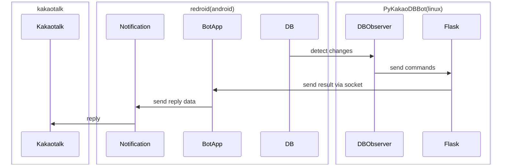

# PyKakaoDBBot
Python Kakaotalk bot using redroid & Android notification based bot apps.

### Sequence Diagram


## 1. Installation
### 1.1 Clone repository
```shell
git clone https://github.com/dolidolih/PyKakaoDBBot.git
cd PyKakaoDBBot
```

### 1.2 Docker 설치
Docker의 공식 설치 가이드에 따라 설치하세요:
https://docs.docker.com/engine/install/

### 1.3 Redroid 설치 및 실행
- docker container 실행
```shell
docker run -itd --privileged \
    -v ~/data:/data \
    -p 5555:5555 \
    -p 3000:3000 \
    redroid/redroid:11.0.0-latest \
    ro.product.model=SM-T970 \
    ro.product.brand=Samsung
```
- adb, scrcpy, bot app, kakaotalk 설치
```shell
sudo apt install android-sdk-platform-tools scrcpy
adb connect localhost:5555
adb install YOUR_APP.apk
scrcpy -s localhost:5555
```

### 1.4 Config 설정
- config.json을 열어 config를 설정합니다.
```javascript
# config.json
{
    "bot_name" : "YOUR_BOT_NAME", // 봇 이름
    "bot_id" : YOUR_BOT_ID, // 봇 ID
    "db_path" : "/home/YOUR_LINUX_USERNAME/data/data/com.kakao.talk/databases", // 리눅스 username 반영
    "bot_ip" : "127.0.0.1",
    "bot_socket_port" : 3000,
    "commands" : ["!hi"] // 명령어를 리스트 형식으로 추가
}
```
※ BOT_ID(봇 계정의 user_id)는 아래 스크립트를 이용하여 유추할 수 있습니다. (일반적으로 가장 짧은 데이터):
https://github.com/jiru/kakaodecrypt/blob/master/guess_user_id.py

### 1.5 Bot App Script 복사
- 안드로이드 sdcard에 'response.js'를 복사합니다.
```shell
sudo cp response.js $HOME/data/media/0/msgbot/Bots/YOUR_BOT/YOUR_BOT.js
sudo ls -al $HOME/data/media/0/msgbot/Bots/YOUR_BOT
sudo chown BOTAPPUSER:BOTAPPUSER $HOME/data/media/0/msgbot/Bots/YOUR_BOT/YOUR_BOT.js
```

### 1.6 파이썬 Virtual env 설정 및 기본 패키지 설치
```shell
python3 -m venv venv
source venv/bin/activate
pip install pip -- upgrade
pip install -r requirements.txt
```
### 1.7 /data 퍼미션 설정
```shell
sudo chmod -R 777 $HOME/data/data
```
----
## 2. 사용 방법
### 2.1 Python script 실행
```shell
venv/bin/python observer.py &
venv/bin/python venv/bin/gunicorn -b 0.0.0.0:5000 -w 9 app:app &
```

### 2.2 봇 스크립트 수정
- chatbot/Response.py 를 수정하여 봇 스크립트를 작성하고, replier.reply() 메소드를 통해 채팅창에 출력할 수 있습니다.
- 다른 방으로 보내는 경우, replier.send_socket(self, is_success,type,data,room,msg_json) 을 이용할 수 있습니다.

### End
