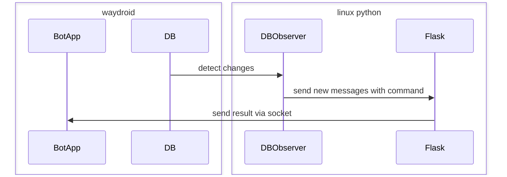

# PyKakaoDBBot
Python Kakaotalk bot using Waydroid & Android notification based bot apps.
## 1. Installation
### 1.1 Install Wayldroid
Follow the below instruntion by destribution:
https://docs.waydro.id/usage/install-on-desktops

※ Waydroid only runs on wayland environment. Use Weston in x11.

### 1.2 Start Waydroid
- Starting Android Environment
```shell
sudo waydroid init
sudo systemctl start waydroid-container
waydroid session start &
```
- Install KakaoTalk, Bot app
```shell
waydroid app install YOUR_APP.apk
```

### 1.3 Set up BOT data
- Set constants in dbobserver.py
```python
# dbobserver.py
BOT_NAME = '' #add BOT open profile name
BOT_ID =  #add BOT userid
```
※ BOT_ID(user id of a bot account) can be guessed with a script below(usually the shortest one):
https://github.com/jiru/kakaodecrypt/blob/master/guess_user_id.py

### 1.4 Set up Android Bot App Script
- Copy 'response.js' to Android environment
```shell
sudo cp response.js $HOME/.local/share/waydroid/data/media/0/msgbot/Bots/YOUR_BOT
```
- Load the script copied in the bot app you installed. To access Android environment:
```shell
waydroid show-full-ui
```

### 1.5 Virtual env and install requirements
```shell
python3 -m venv venv
source venv/bin/activate
pip install pip -- upgrade
pip install -r requirements.txt
```

----
## 2. How to Use
### 2.1 Running python scripts
```shell
venv/bin/python dbobserver.py &
venv/bin/python venv/bin/gunicorn -b 0.0.0.0:5000 -w 9 app:app &
```
### 2.2 Customizing bot functionalities
- modify on_close() function inside app.py
- request_data will include msg, sender, room data you need
- use send_via_socket or send to send your final result.
```python
@response.call_on_close
    def on_close():
        send_via_socket(True,"string","hello",request_data["room"],"{}")
```


### Sequence Diagram


### End
